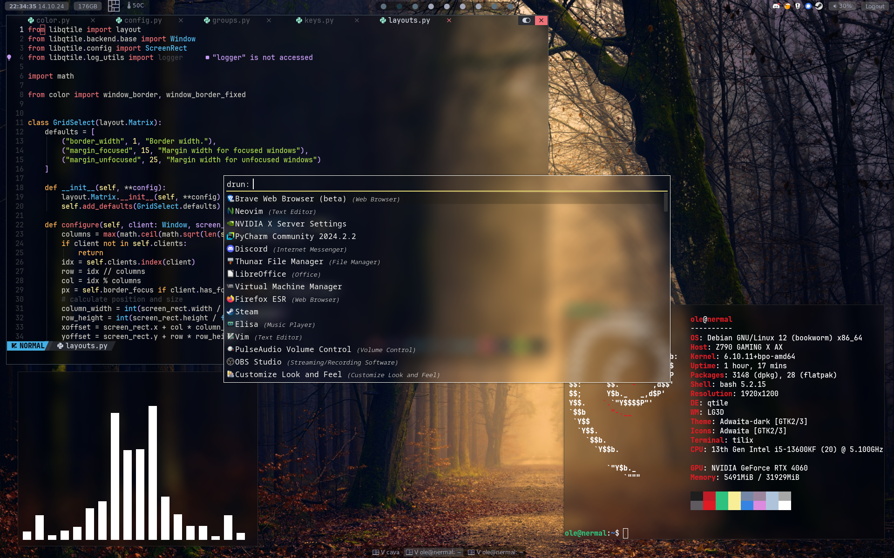

# My dotfiles
This repository contains some of my configurations files.
    - [Qtile](https://qtile.org)  
    - [Picom](https://github.com/yshui/picom)  
    - [Rofi](https://davatorium.github.io/rofi/)  
    - [Neovim](https://neovim.io/) with [NvChad](https://nvchad.com/)  
    - [Betterlockscreen](https://github.com/betterlockscreen/betterlockscreen)

To quickly install all of the config files run `./install.sh` in the project folder.

**Wallpaper Source**: https://unsplash.com/photos/yellow-lights-between-trees-hvrpOmuMrAI
